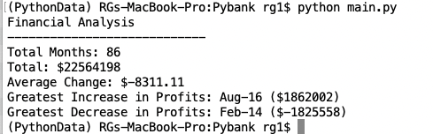
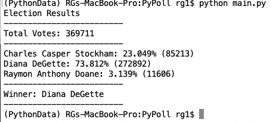

# PyBank and PyPoll data analysis 

Author: Rosie Gianan, gianr00@gmail.com

Build with: Python 3.9.12, Visual Studio Code

## Objective:
Analyze two csv files using Python scripting. 
1.    PyBank - Analyze the company’s financial records and create a budget summary report
2.    PyPoll – Analyze a rural town election data and create the election result summary report

## Solution:
1.    PyBank analysis - Create a Python script that reads each record from the [budget_data.csv](PyBank/Resources/budget_data.csv) file, analyzes the records and generate a budget summary report with the following information:
-    The total number of months included in the dataset
-    The net total amount of "Profit/Losses" over the entire period
-    The changes in "Profit/Losses" over the entire period, and then the average of those changes
-    The greatest increase in profits (date and amount) over the entire period
-    The greatest decrease in profits (date and amount) over the entire period

Budget summary report:

2.    PyPoll analysis - Create a Python script that reads each record from the [election_data.csv](PyPoll/Resources/election_data.csv) file, analyzes the records and generate an election summary report with the following information:
-    The total number of votes cast
-    A complete list of candidates who received votes
-    The percentage of votes each candidate won
-    The total number of votes each candidate won
-    The winner of the election based on popular vote.

Election summary report:

